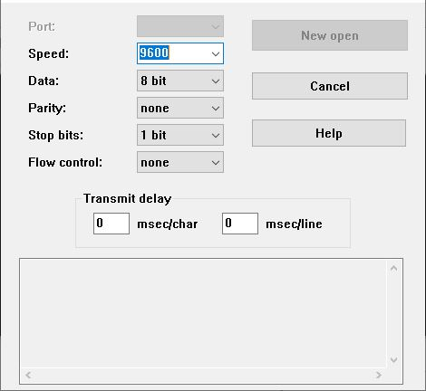
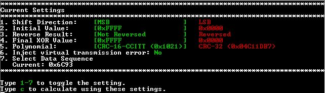
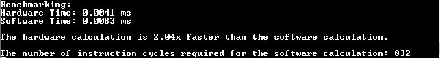

<picture>
    <source media="(prefers-color-scheme: dark)" srcset="images/microchip_logo_white_red.png">
	<source media="(prefers-color-scheme: light)" srcset="images/microchip_logo_black_red.png">
    
</picture>

# dsPIC33CK Curiosity CRC Advanced Code Example

**NOTE**: Basic Code Example for MCC Melody CRC Module: [dsPIC33CK Curiosity CRC Basic Code Example](https://github.com/microchip-pic-avr-examples/dspic33ck-curiosity-crc-basic)

The code example uses the [MPLAB® Code Configurator Melody CRC Driver](https://www.npmjs.com/package/@mchp-mcc/crc-16bit-driver) to configure the CRC module using settings determined at runtime. These settings can be toggled with a menu that is displayed in the terminal. This will calculate the CRC value with a hardware implementation utilizing the MCC Melody CRC Module and a software implementation. These two values are then compared to verify the calculation. The calculations are also timed, and the results are printed at the end, along with other benchmarking information.

## Related Documentation

[MCC Melody CRC API Reference](https://onlinedocs.microchip.com/v2/keyword-lookup?keyword=CRC_16BIT_MELODY_DRIVER&version=latest&redirect=true)

## Software Used

### Required Software

- MPLAB® X IDE **6.15** or newer (https://www.microchip.com/MPLABXIDE)
- MPLAB® XC16 Compiler **2.10** or a newer compiler (https://www.microchip.com/xc16)
- MPLAB® Code Configurator (MCC) **5.6.1** or newer (https://www.microchip.com/mcc)
- MPLAB® Code Configurator (MCC) Melody **2.6.1** or newer (https://www.microchip.com/melody)
- CRC Driver **1.0.3** or newer (MCC Content Manager)
- CRC PLIB **1.3.0** or newer (MCC Content Manager)
- UART Driver **1.10.0** or newer (MCC Content Manager)
- UART PLIB **1.5.0** or newer (MCC Content Manager)
- Any terminal program, like MPLAB® Data Visualizer (https://www.microchip.com/datavisualizer) or Tera Term (https://ttssh2.osdn.jp/index.html.en)

## Hardware Used

### Required Hardware

- [dsPIC33CK Curiosity Development Board (dsPIC33CK256MP508)](https://www.microchip.com/en-us/development-tool/DM330030)

## Hardware Setup

1. Connect the board to the PC using a USB cable.

    

## Software Setup

### Terminal Setup (Data Visualizer)

1. Launch the MPLAB® Data Visualizer.

    

2. Find the correct COM Port from the list on the left and click the play button.

    

3. Select the "Send to Terminal" button.

    

4. Click on the settings icon next to the source dropdown in the input section.

    

5. Verify that the serial port settings match the following:

    

### Terminal Setup (Tera Term)
1. Launch Tera Term
2. Go to File -> New Connection.
3. Select the "Serial" option and select the correct COM Port from the dropdown menu.

    

4. Go to Setup -> Serial port and ensure that the settings match the following:

    

### Compiler Optimization

The MPLAB® XC16 compiler provides users with compiler optimization options. These options allow the user to speed up their code. This CRC Advanced Demo is functional at all optimization levels. 

The optimization settings can be found in the project properties. Go to Project Properties -> XC16 -> Optimization Level to change optimization level for the project. The table below shows the optimization results for hardware and software CRC calculations with the default settings. 

| Optimization Level | Hardware CRC (Default Settings) | Software CRC (Default Settings) |
|---|---|---|
| 0 |0.0130 ms|0.0198 ms|
| 1 |0.0082 ms|0.0118 ms|
| 2* |0.0075 ms|0.0092 ms|
| s** |0.0086 ms|0.0126 ms|
| 3** |0.0072 ms|0.0070 ms|

*Project is set to this level by default

**MPLAB® XC16 PRO optimizations

## CRC Settings

The CRC calculations performed in this code example have different settings that can be toggled at runtime.

- Shift direction: The direction the data is shifted through the registers. Can start with the most significant bit (MSB) or the least significant bit (LSB)
- Initial Value: The initial value of the CRC result. Can theoretically be anything, but traditionally is either zero (0x0000 for 16-bit or 0x00000000 for 32-bit) or -1 (0xFFFF for 16-bit or 0xFFFFFFFF for 32-bit).
- Reverse: The result of the CRC calculation can be reversed immediately after calculation. Reverse operation is performed if the flag is true.
- Final XOR Value: The value XOR'd with the CRC result after the calculation and any reverses. Can theoretically be anything, but traditionally is either zero (0x0000 for 16-bit or 0x00000000 for 32-bit) or -1 (0xFFFF for 16-bit or 0xFFFFFFFF for 32-bit).
- Polynomial: Generator polynomial used in the calculation of the CRC value. Many effective polynomials exist. This code example uses the polynomials for CRC-16-CCITT (0x1021) and CRC-32 (0x04C11DB7).
- Data: The input data for which the CRC value is calculated. Can be any value of any length. Four data strings can be used in this code example:
  - 0x68, 0x69, 0x21, 0x20 ("hi! ")
  - 0x38, 0x37, 0x36, 0x35, 0x34, 0x33, 0x32, 0x31 ("87654321")
  - 0x2F, 0x2F, 0x20, 0x48, 0x65, 0x6C, 0x6C, 0x6F, 0x20, 0x77, 0x6F, 0x72, 0x6C, 0x64, 0x21, 0x20 ("// Hello world! ")
  - 0x00, 0x00, 0x00, 0x00 (All null characters)

### Online Calculator

Online calculators can be used to test different configurations and try different settings. Most developers compare results with an online calculator. An example that was used in the development of this code example is the [Online Calculator by Sven Reifegerste (Zorc)](http://www.zorc.breitbandkatze.de/crc.html).

**Online Calculator**:

**Note**: Number 8, Seed Shift Direction, is assumed to be MSB in this online calculator.

**MCC Melody**: 

**Note**: The "Reverse CRC value" and "Final XOR Value" only work for the simulator, they will not be used in the firmware calculations.

The firmware function CRC_CalculationGet() is where the Reverse and Final XOR Value settings are implemented.

## Operation

Open the dspic33ck-curiosity-crc-advanced project in MPLAB® X IDE.

Open the terminal program that will be used. 

In the MPLAB® X IDE, build and program the device.

Upon building, a menu will be printed in the terminal program displaying the settings the user is able to toggle by entering the corresponding number (1-7).

| Number | Menu Setting | MCC Melody CRC Setting | Option 1 | Option 2 |
| --- | --- | --- | --- | --- |
| 1 | Shift Direction | Shift Direction | MSB | LSB | 
| 2 | Initial Value | Initial Value | -1 (0xFFFF/0xFFFFFFFF) | 0 (0x0000/0x00000000) |
| 3 | Reverse Result | Reverse | Not Reversed | Reversed |
| 4 | Final XOR Value | Final XOR Value | -1 (0xFFFF/0xFFFFFFFF) | 0 (0x0000/0x00000000) |
| 5 | Polynomial | Polynomial | CRC-16-CCITT (0x1021) | CRC-32 (0x04C11DB7) |
| 6 | Inject virtual transmission error **\*** | N/A | No | Yes |
| 7 | Select Data Vector | Data | Data Submenu | N/A |

**\*** Inject virtual transmission error - allows the user to force an error in the virtual transmission. It XOR's the first byte by 0x10. This demonstrates the CRC's error detection capabilities.

If "7" is selected, the data submenu will be printed. Here, the user can select the data vector to be used in the calculations.

Once the required settings are configured, enter "c" to begin the hardware calculation. The data vector will be reprinted, along with the result of the hardware CRC calculation.

The menu will also be reprinted, allowing users to change settings to see how the CRC value adjusts. 

**NOTE: If any settings are toggled after calculating, ensure to enter 'c' to recalculate with the new settings.**

Enter "t" to progress to the virtual transmission and software CRC calculation. The data vector will be reprinted, showing what is being sent by the virtual transmitter. This is the data appended by the hardware CRC value. The data vector will be reprinted after the virtual transmission, and will have the error caused by the virtual transmission, if enabled. This data vector is what the virtual receiver receives. A software CRC calculation is then performed, and its results are printed.

The software CRC calculation result is compared with the value of the hardware CRC result from the virtual message. It will print whether or not the transmission has been validated. 

Successful transmission:

Invalid transmission:

### Benchmarking

The final part of the project is the benchmarking. While the hardware and software CRC values are being calculated, they are also being timed using the MCC Melody Timer module. The difference between the two values is also calculated. The benchmarking compares the performance of hardware CRC to software CRC for various CRC configurations. 

Additionally, the number of instruction cycles is printed for the software implementation.

**NOTE:** This is not the fastest software implementation of CRC, but it is the simplest in terms of code. 